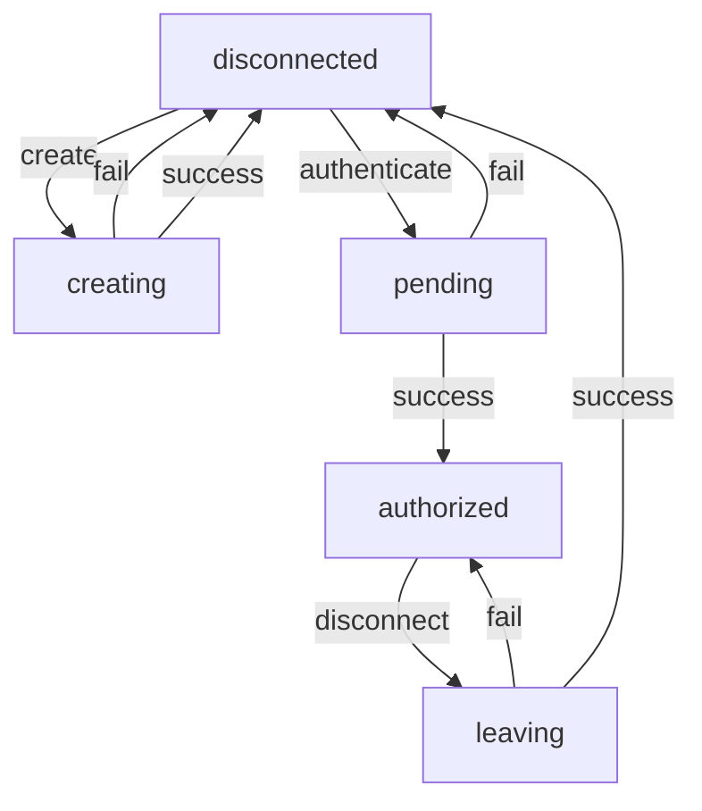

# Authentication

The GunPlus wraps gun's user authentication to achieve primarily two things:

- Make authentication into promises.

- Use a state machine

It is possible to subscribe to updates from `GunPlus.auth_state`. This state will be kept in sync using a state machine with the transistions defined below:




## Usage
You can do authentication like so:
```js
GunPlus.auth_state.subscribe(state => console.log(state));
try{
	await GunPlus.auth(pair)
}catch(err){
	console.warn(err);
}
```

## Types

You might notice that the functions in `GunPlus.auth` work with `GunAlias` and `GunPassword` values.
The are really just strings, but you must get them through the `GunPlus.auth.validate` function.

This function may in the future run more advanced asyncronous logic to decide if a given alias/password pair is valid.
Currently it just:

- checks that the password is more than 8 characters long, since this is the minimum length accepted by gun.
- scopes users to the app scope specified in GunPlus.

---

If you need to access the user chain, e.g for putting a reference to the user on the graph, you should access this through `GunPlus.instance.user.chain` instead of `GunPlus.instance.gun.user()`. This will ensure that a public key can be inferred from the user, i.e. `gun.user()` is NOT the same thing as a regular gun chain, while `GunPlus.instance.user.chain` is.

## Errors
Attempting to make a transition that is not explicitly defined will throw a `StateTransitionError` . This error has 

- a `state` property indicating what the state was at the time the error was thrown.
- and a `event` property with the type of the event that was attempted to make a transition for on that state.